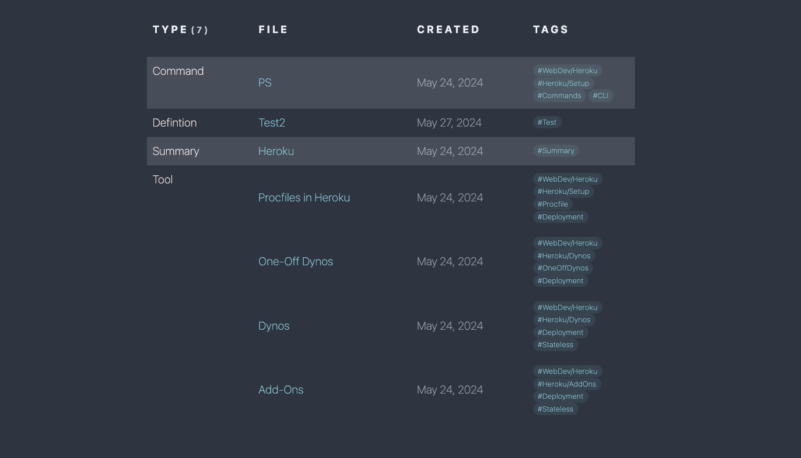

# Dynamic Table of Contents with DataviewJS and Custom CSS

This project provides a dynamic Table of Contents (TOC) for Obsidian, generated using DataviewJS. The TOC dynamically lists all files within the current folder and its subfolders, categorizing them by type and displaying relevant metadata. Custom CSS is used to style the table, making it visually appealing and easy to navigate.

## Features

- **Dynamic TOC Generation**: Automatically lists files in the current folder and its subfolders.
- **Categorization by Type**: Groups files by their type for better organization.
- **Custom Metadata Display**: Shows file link, creation date, and tags.
- **Custom Styling**: Includes CSS for styling the table, with alternating row colors, custom font sizes, and more.

## Requirements

- Obsidian with Dataview plugin installed and enabled.

## Installation

1. **Clone or Download Repository**:
   - Clone the repository or download the files to your local machine.

2. **Copy Template**:
   - Copy the [Template.md] into whatever folder you store templates in, usually `Templates`.
   (If you don't have a `Templates` folder, go to obsidan settings>Core Plugins>Templates and set a template folder)
   - You can now paste the template in using the `Template` button in the editor or using the command palette.

3. **Copy CSS**:
   - Open up the CSS snippets folder in obsidian. (Settings>Appearance>CSS Snippets)
   - Copy the [TOC_Table.css] file into the CSS snippets folder.

Done! You can now use the template to generate a dynamic TOC in any note.

## Usage

1. **Open the TOC Note**:
   - Navigate to the note where you pasted the `dataviewjs` script.

2. **Refresh the Note**:
   - Refresh the note to generate the dynamic TOC. The table will list all files in the current folder and its subfolders, categorized by type.

3. **View and Navigate**:
   - Use the generated TOC to view and navigate through your files. The table includes links to each file, creation dates, and tags.

## Customization

   - Customize the CSS in the [TOC_Table.css] file to change the appearance of the TOC table.
   - Modify the `dataviewjs` script in the [Template.md] file to adjust the table columns, sorting, and grouping. (Remeber to update existing tables for changes to take effect)

